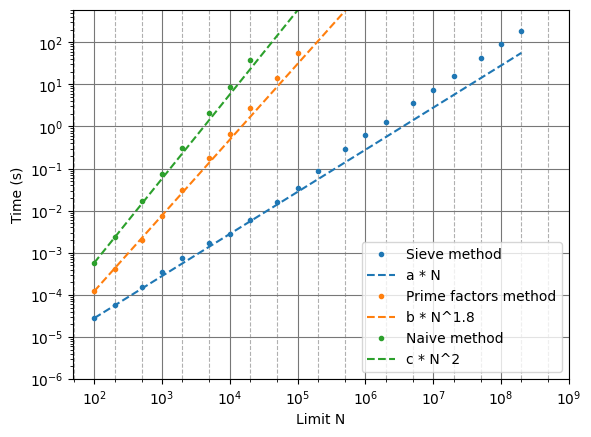

# Euler totient function $\varphi$ sieve algorithm

This repo contains an algorithm using a sieve in order to compute $\varphi(n)$ for every $n$ under a certain limit $N$.

## Principle

This algorithm uses the formula $\varphi(n) = n\sum_{p|n} \frac{p-1}{p}$ to compute the value of $\varphi$ for every $n$, but instead of computing it " $n$ by $n$", it does it " $p$ by $p$". We start with an array $a$ where $a[n] = n$ for every n. We then go through every number $p$ from 2 to $N$, and if it is prime, we multiply the array at index $kp < N$ by $\frac{p-1}{p}$. This allows us to not compute the prime factors of every number independently.

The time complexity of such an algorithm is around $O(N\log^2N\log\log N)$. The $\log^2N$ comes from the time complexity of the modulo operation in Python, and the $\log\log N$ comes from a term of the form $\sum_{p\leq N} \frac{1}{p}$ (with $p$ prime), which is equivalent to $\log\log N + M$ where $M$ is a constant.

## Usage
```python phi.py <LIMIT>```

where `LIMIT` is a positive integer with default value 100,000. It will save the values to a file named `phi_values_<LIMIT>.txt`.


## Time comparison with other algorithms

I did some test to compare it to two others algorithm, the naive one and one using prime factors.

The naive one consist to count how many numbers $k$ ( $1 \leq k \leq n$ ) are prime with $n$ for every $n$ below $N$. This algorithm has time complexity around $O(N^2\log^3N)$ : the $N^2$ comes from looping over every $k$ for every $n$, and the $\log^3N$ comes from the time complexity of the Euclid GCD algorithm ( $O(\log N)$ ) and the time complexity of the modulo operation in Python ( $O(\log(a)\log(b))$ for a%b ).

The prime factor algorithm uses the same formula $\varphi(n) = n\sum_{p|n} \frac{p-1}{p}$, where $p$ is prime. To compute $\varphi(n)$, we just start from $n$ and then look for all its prime factors and multiply successively by $\frac{p-1}{p}$. Its time complexity should be around $O(N\sqrt{N}\log^2N)$. The $\sqrt{N}$ comes from the algorithm to find every prime factor of a number N, and the $\log^2N$ comes from the same place as the naive algorithm. However, according to my time measurements, it seems its time complexity is quite a lot greater than this.

The time measurement were done on a i7-6700 CPU with 32 GB of RAM with Python 3.11. For every $N$, the algorithm was executed 10 times and the smallest time was used to plot the graph.

The functions $a \times x^\alpha$ are there as references to compare the algorithms to.


